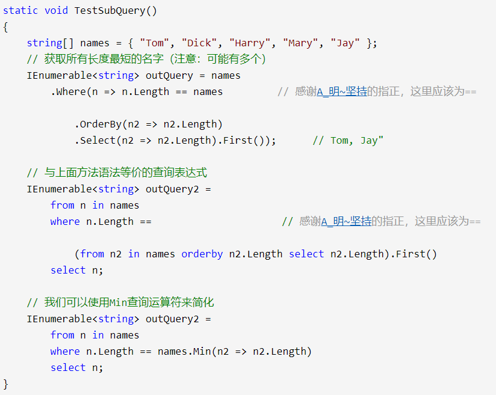

LINQ学习记录，摘自博客园
<!-- more -->
## 初试LINQ

体验了`方法语法`和`查询表达式语法`

## C# 3.0的语言功能

### 隐式类型局部变量

var

#### 限制

只能应用于`Method`或者属性内部局部变量的声明，不可用来定义返回值、参数的类型或类型的数据成员。

#### 是强类型数据

```c#
        static   void ImplicitTypingStrongTyping()
        {
            // 编译器知道 s 是System.String类型
            var   s = "This variable can only hold string   data!";
            s = "It's   OK.";
 
            // 可以调用任何基础方法
            string   upper = s.ToUpper();
           
            // 错误！不能把数值类型数据赋给String类型变量
            s = 100;
        }
```

#### 作用

其实，我们可以认为只有在定义从LINQ查询返回的数据时才使用var关键字。

#### 自动属性

```c#
    class Person
    {
        public string FirstName { get; set; }
        public string LastName { get; set; }
        public int Level { get; set; }
    }
```

需要注意的是，***定义自动属性时，必须同时提供get和set关键字***，因此不能定义只读或者只写的自动属性。

#### 匿名类型

```c#
var worker = new { FirstName = "Vincent", LastName = "Ke", Level = 2 };
```

#### 相等语义

编译器重写的Equals()在判断对象时使用了基于值的语义，但编译器并没有重载（\==和!=）相等运算符，因此使用\==比较两个匿名对象时，是基于引用的语义！”\==”比较引用是对所有类的默认行为。

### 扩展方法

当需要为类型添加新功能但并不拥有类型的已有代码时，比如，我们想要为.NET库类型List添加自定义的dump方法时，该怎么做呢，答案是扩展方法。

#### 定义

第一个限制就是**必须把方法定义在静态类中**

第二个限制是扩展方法要用**this关键字对第一个参数进行修饰**，这个参数也就是我们希望进行扩展的类型

比如下面的扩展方法允许.NET基类库中的所有对象都拥有全新的方法DisplayDefiningAssembly()。

```c#
        static class MyExtensions
        {
            // 本方法允许任何对象显示它所处的程序集
            public static void DisplayDefiningAssemlby(this object obj)
            {
                Console.WriteLine("{0} is defined in: \n\t {1}\n",
                    obj.GetType().Name,
                    System.Reflection.Assembly.GetAssembly(obj.GetType()));
            }
        }
```

#### 调用

两种方式：

1. 实例层次上调用
2. 静态调用

```c#
        public void UsingExtensionMethods()
        {
            int myInt = 12345;
 
            // 1. 在实例层次上调用扩展方法
            myInt.DisplayDefiningAssemlby();
 
            // 2. 静态调用扩展方法
            MyExtensions.DisplayDefiningAssemlby(myInt);
        }
```

其实实例调用背后编译器会转换成静态方法调用。

#### 其他注意事项

扩展方法本质上是可以从扩展类型的实例上调用的静态方法。所以它和普通的方法是不一样的，扩展方法不能直接访问扩展类型的成员，从另外一个角度讲，扩展方法即不是直接修改，也不是继承。

另外一个要注意的地方是：虽然表面上扩展方法是全局的，但其实他们受制于所处的命名空间，要使用在其他命名空间中定义的扩展方法时，我们首先需要导入该命名空间。

### Lambda表达式

Lambda表达式的引入是与委托类型的使用密切相关的，本质上，Lambda表达式只是用更简单的方式来书写匿名方法，从而彻底简化.NET委托类型的使用。

#### 传统委托使用方式

#### 匿名方法取代显式的委托函数

#### Lambda表达式

### 对象初始化器

C# 3.0提供的 对象初始化器语法用来初始化新类或新结构变量的状态。使用这种语法，我们可以以一种非常简洁的方式来创建对象和为对象的属性赋值。

```c#
Point bPoint = new Point { X = 10, Y = 20 };
```

#### 使用初始化语法调用构造函数

上面的示例中，对象初始化语法会隐式调用默认的构造函数初始化Point实例，而且我们还可以显示调用定制的构造函数，如下：

```c#
        static void ObjectInitSyntax()
        {
            // 在这里，默认构造函数被隐式调用
            Point bPoint = new Point { X = 10, Y = 20 };
 
            // 我们也可以显示调用默认构造函数
            Point cPoint = new Point() { X = 10, Y = 20 };
 
            // 我们还可以调用自定义的构造函数，只是这里1, 2会被10, 20覆盖
            Point dPoint = new Point(1, 2) { X = 10, Y = 20 };
        }
```

#### 初始化内部类型

对象初始化语法不但大大减少了我们敲打键盘的次数，也更加的简洁明了

#### 集合的初始化

```c#
static void CollectionInitSyntax()
        {
            // 初始化标准数组
            int[] numbers = { 0, 1, 2, 3, 4, 5, 6, 7, 8, 9 };
 
            // 初始化一个ArrayList
            ArrayList list = new ArrayList { 0, 1, 2, 3, 4, 5, 6, 7, 8, 9 };
 
            // 初始化一个List<T>泛型容器
            List<int> list2 = new List<int> { 0, 1, 2, 3, 4, 5, 6, 7, 8, 9 };
 
            // 如果容器存放的是非简单对象
            List<Point> pointList = new List<Point>
            {
                new Point { X = 2, Y = 2},
                new Point { X = 3, Y = 3}
            };
 
            // 使用恰当的缩进和嵌套的大括号会使代码易于阅读，同时节省我们的输入时间
            // 想想如果不使用初始化语法构造如下的List，将需要多少行代码
            List<Rectangle> rectList = new List<Rectangle>
            {
                new Rectangle { TopLeft = new Point { X = 1, Y = 1},
                    BottomRight = new Point { X = 2, Y = 2}},
                new Rectangle { TopLeft = new Point { X = 3, Y = 3},
                    BottomRight = new Point { X = 4, Y = 4}},
                new Rectangle { TopLeft = new Point { X = 5, Y = 5},
                    BottomRight = new Point { X = 6, Y = 6}}
            };
        }
```

## LINQ方法语法

> 方法语法的本质是通过扩展方法和Lambda表达式来创建查询。C# 3.0对于LINQ表达式还引入了声明式的查询语法，通过查询语法写出的查询比较类似于SQL查询。

另外，.net公共语言运行库（CLR）并不具有查询语法的概念。编译器会在程序编译时把查询表达式转换为方法语法，即对扩展方法的调用。所以使用方法语法会让我们更加接近和了解LINQ的实现和本质，并且一些查询只能表示为方法调用，如：

* 检索序列中的最大值
* 最小值元素的查询

#### 链接查询运算符

在LINQ介绍中，我们示范了使用单个查询运算符创建的查询。如果需要创建更加复杂的查询，我们可以在表达式之后添加其他查询运算符，产生一个查询链。

```c#
IEnumerable<string> filterNames = names
                .Where(n => n.Contains("a"))
                .OrderBy(n => n.Length)
                .Select(n => n.ToUpper());
```

表示：查询出所有包含字母“a”的姓名，按长度进行排序，然后把结果全部转换成大写格式。

`Where`、`OrderBy`、`Select`这些标准查询运算符对应Enumerable类中的相应扩展方法。

`Where`产生一个经过过滤的sequence；

`OrderBy`生成输入sequence的排序版本；

`Select`得到的序列中的每个元素都经过了给定lambda表达式的转换。

## LINQ查询表达式

> 尽管通过查询语法写出的查询比较类似于SQL查询，但实际上查询表达式的产生并不是建立在SQL之上，而是建立在函数式编程语言如LISP和Haskell中的list comprehensions(列表解析)功能之上。

以上一篇为例：获取所有包含字母“a”的姓名，按长度排序并将结果转为大写。

```c#
IEnumerable<string> query =
                from n in names
                where n.Contains("a")     // Filter elements
                orderby  n.Length        // Sort elements
                select n.ToUpper();        // Translate each element
```

**查询表达式总是以from自居开始，以select或group子句结束。**From子句定义了查询的范围变量（range variable），可以认为该变量是对输入sequence的一个遍历，就像foreach做的那样。

#### 范围变量

范围变量是紧随from之后定义的变量，一个范围变量指向当前操作符所对应的输入sequence中的当前元素。

但变量实际是对不同的sequence的遍历：

```c#
 IEnumerable<string> query =
                from n in names         //n是我们定义的范围变量
                where n.Contains("a")   //n直接来自names array
                orderby n.Length        //n来自filter之后的subsequent
                select n.ToUpper();     //n来自OrderBy之后的subsequent
```

除此之外，查询表达式还允许我们通过下面的子句引入新的范围变量：

* let
* into
* 额外的from子句

#### 查询表达式的方法语法

查询表达式和方法语法各有所长。对下面的场景来讲，用查询表达式写出来得查询会更加简洁：

- 使用let关键字引入新的范围变量
- 在SelectMany、Join或GroupJoin后引用外部范围变量时

#### 组合查询语法

当一个查询运算符没有对应的查询语法时，我们可以组合使用查询语法和方法语法。唯一的约束是查询中的每一个查询语法部分必须是完整的，如以from开始以select或group结束。

```c#
// 计算包含字母”a”的姓名总数
            int matches = (from n in names where n.Contains("a") select n).Count();     // 3
            // 按字母顺序排序的第一个名字
            string first = (from n in names orderby n select n).First();     // Dick
```

## 延迟执行

> 大部分查询运算符都不是在查询创建的时候执行，而是在遍历的时候执行。


如上，在`foreach`对query进行遍历时，LINQ查询才会执行。除了下面两种查询运算符，所有其他的运算符都是延迟执行的：

* 返回单个元素或者标量值的查询运算符，如First、Count
* 转换运算符：ToArray、ToList、ToDictionary、ToLookup

作用：

将查询的`创建`与`执行`解耦，分多步骤创建LINQ查询

### 重复执行

延迟执行带来的影响是：重复遍历，查询会被重复执行。

有时候，这并不是一个优点：

* 当需要在某一个给定的点保存查询结果时
* 有些查询比较耗时，性能上考量不希望被重复执行

解决方案：

使用`转换运算符`，如`ToArray`、`ToList`避开重复执行，ToArray把查询结果保存至一个Array，而ToList把结果保存至泛型List<>

### 变量捕获

另一个副作用是变量捕获。

当查询的lambda表达式引用了程序的局部变量时，查询会在`执行时`对变量进行捕获。这就意味着，如果在查询定义后改变了变量值，那么结果也会随之改变。


仅有”u“会被过滤，因为vowel在循环之外，每个表达式都捕获了同一变量。


写到循环内即可。

---

评论给出：

其实对延迟执行起关键作用的是方法里面的yield return关键字，而不是返回值IEnumerable<T>，编译器为yield return关键字生成的包装类支持了延迟执行。比如下面的方法就不会延迟执行：

```c#
static IEnumerable<int> getX2()
{
IList<int> list = new List<int>();
for (var i = 0; i < X; i++) list.Add(i);
return list;
}
```

另外，过滤元音字母也可以用：

```c#
query = query.Where(c => "aeiou".IndexOf(c) == -1);
```

归根揭底就是迭代器的原因
如：ToList(),ToArray(),Sum(),Count()...一些可以及时执行的扩展方法，这些方法你反编译可以看出和我们平常的方法没有太多的区别，
再看看不能及时执行的一些方法，如：where(),GroupJoin(),OrderBy()..等方法的实现中都返回一个迭代器 yield return
我们也知道迭代器的行为很特殊，它不是一次返回集合中的所有值，而是每次返回一个值，只有当你需要使用的时候，值才会返回，当使用foreach遍历值时，才能获取迭代器中的所有值。

另：在新版本中`foreach`可以遍历，但for循环不可以

---

## 子查询、创建策略和数据转换

### 子查询

> 在LINQ中：
>
> 对于方法语法，一个子查询包含在另外一个查询的lambda表达式中
>
> 对于表达式语法，所有不是from子句中引用的查询都是子查询

使用子查询对lastname进行排序，语句中的n.Split().Last()就是一个子查询：

```c#
string[] names = { "David Tim", "Tony Sin", "Rager Witers" };
            IEnumerable<string> query = names.OrderBy(n => n.Split().Last());
```

子查询的作用域限定在当前的lambda表达式中，并且可以引用外部lambda表达式的参数（查询表达式的范围变量）。

下面的查询获取所有长度最短的名字（注意：可能有多个）：



一个子查询在包含它的lambda表达式执行时被执行，这意味着子查询的执行取决于外部查询。需要注意的是：本地查询（LINQ to Objects）和解释查询（LIQN to SQL）对于子查询的处理方式是不一样的。

**对于本地查询，对于外部查询的每一次循环，子查询都会被重新执行一次。**

在稍后“**解释查询**”一篇中， 我们会看到，**外部查询和子查询是作为一个单元进行处理的**，这样，只需一次到远程数据源（如数据库）的连接。所以上面的例子对于一个数据库查询来说非常适合，但对于一个内存中的集合来说却效率低下，这时我们可以把子查询分离出来对让它只执行一次（这样它不再是一个子查询）。


在延迟执行一篇中，我们说到元素和集合运算符如First和Count会让一个查询立即执行。但对一个子查询来说，即使是元素和集合运算符也不会改变外部查询延迟执行的特性。这是因为，不管是对本地查询还是通过表达式树访问的解释查询，子查询是间接调用的。

### 查询创建策略
待续。。。